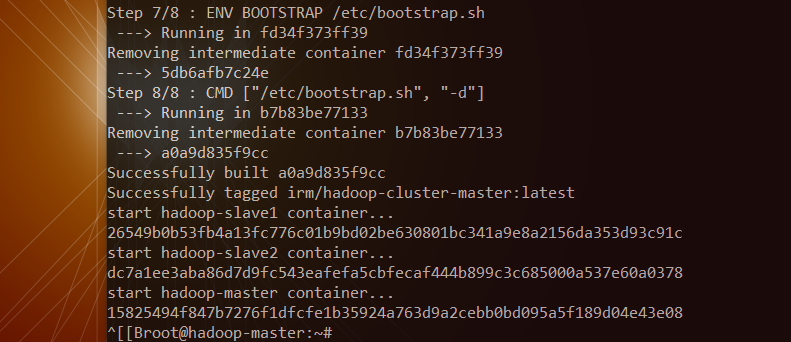
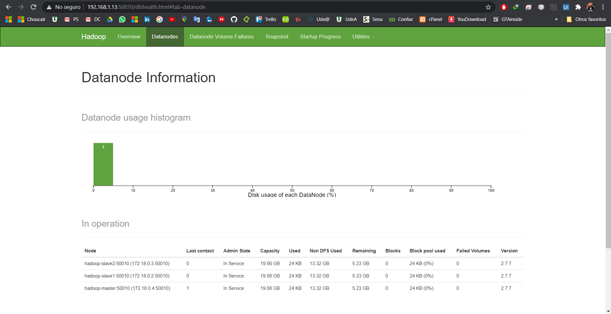
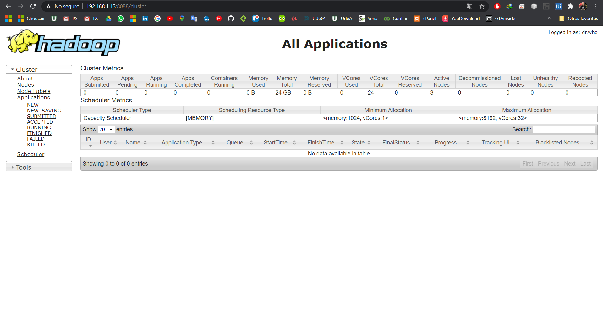

# Install Hadoop From Docker

## Execution

In the machine with Docker execute the commands:

```bash
git clone https://github.com/xlavm/Hadoop.git

cd Hadoop/install_hadoop_from_docker
``` 

Execute the command: `./start-cluster.sh`

>In this case with you see the permission error to the execute. then execute the command: `chmod 700 start-cluster.sh`

## Results

In the bash you see:



If you going to the direcction:  `http://192.168.1.13:50070/`

>You see this:



If you going to the direcction: `http://192.168.1.13:8088/` 

>You see this:



